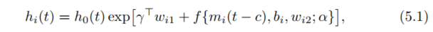
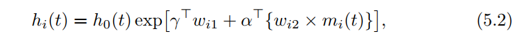
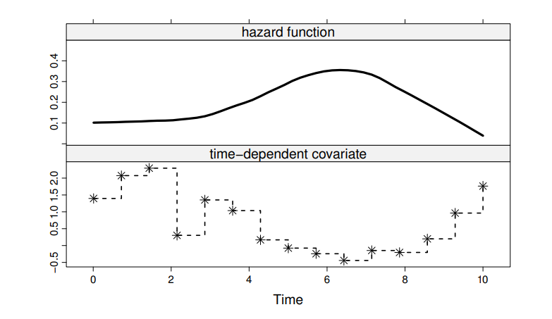
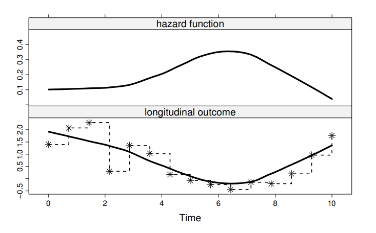
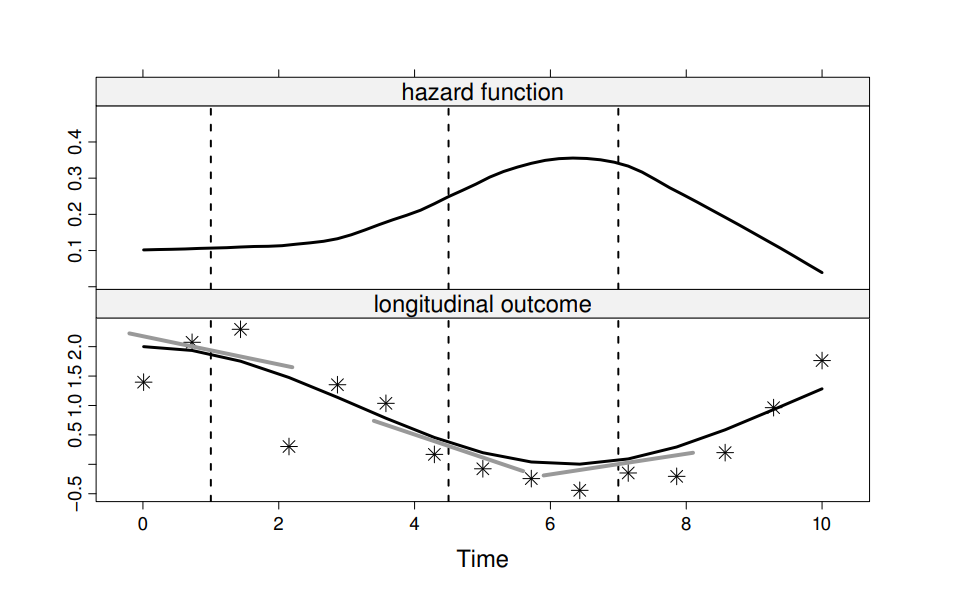
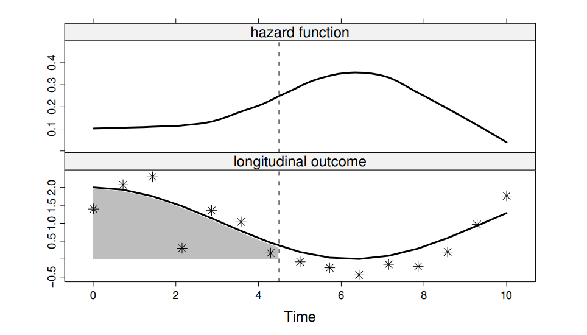
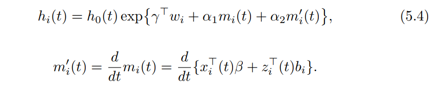

this notes are from  the textbook:\
"Joint Models for Longitudinal and Time-to-Event Data With Applications in R"\
by Dimitris Rizopoulos\
CRC Press/Taylor & Francis Group/A Chapman & Hall Book\

```{r setup, include=FALSE}
knitr::opts_chunk$set(echo = TRUE)
library(tidyverse)
library(survival)
library(JM)
library(broom.mixed)
```

```{r echo=FALSE, out.width='100%'}


```

wi1 is used to accommodate the direct effects of baseline
covariate to the risk for an event, and wi2 contains interaction terms 
that expand the association of mi(t) in different subgroups in the data. 
When wi2 contains only the constant term

```{r}
lme_fit <- lme(log(serBilir) ~ drug * (year + I(year^2)),
               random = ~ year + I(year^2) | id, 
               data = pbc2)

cox_fit <- coxph(Surv(years, status2) ~ drug + hepatomegaly,
                 data = pbc2.id, 
                 ## logical value: if TRUE,
                 ## the x matrix is returned 
                 ## in component x.
                 x = TRUE)
```


```{r}
# joint_fit <- jointModel(lme_fit, 
#                            cox_fit, 
#                            timeVar = "year",
#                            method = "piecewise-PH-aGH",
#                            interFact = list(value = ~ hepatomegaly, 
#                                             ##  a named list with a component named value 
#                                             ##  that provides an R formula specifying the 
#                                             ##  form of the W2 design matrix
#                                             data = pbc2.id))
# save(joint_fit, file = "joint_fit_20210208.Rdata")
load("joint_fit_20210208.Rdata")

summary(joint_fit)
```

```{r echo=FALSE, out.width='100%'}
knitr::include_graphics('img/5_3.png')
```
that the risk at time t depends on the true value of the longitudinal marker at time t−c, 
where c specifies the time lag of interest

```{r}
prothro <- JM::prothro %>% 
  na.omit() 

prothro$t0 <- as.numeric(prothro$time == 0)

lme_pro <- lme(pro ~ treat * (ns(time, 3) + t0),
               ## ns() generate basis matrix 
               ## for natural cubic splines
               random = list(id = pdDiag(form = ~ ns(time, 3))),
               data = prothro)

cox_pro <- coxph(Surv(start, stop, event) ~ treat, 
                 data = prothro,
                 x = TRUE)

cox_pro2 <- coxph(Surv(Time, death) ~ treat, 
                 data = prothros,
                 x = TRUE)
```

```{r}
summary(cox_pro)
summary(cox_pro2)
anova(cox_pro2, cox_pro, test = FALSE)
```

```{r}
# joint_pro <- jointModel(lme_pro,
#                         cox_pro2,
#                         timeVar = "time",
#                         method = "piecewise-PH-aGH")
# joint_pro2 <- update(joint_pro, lag = 2)
# 
# save(joint_pro, file = "joint_pro_20210208")
# save(joint_pro2, file = "joint_pro2_20210208")
# 
load("joint_pro_20210208")
load("joint_pro2_20210208")
```


```{r}
summary(joint_pro)
summary(joint_pro2)
anova(joint_pro, joint_pro2)
```


```{r echo=FALSE, out.width='100%'}




```


```{r echo=FALSE, out.width='100%'}

```


```{r}
## take the interaction term off
# joint_pbc2 <- update(joint_fit, interFact = NULL)
# save(joint_pbc2, file = "joint_pbc2_20210208.Rdata")
load("joint_pbc2_20210208.Rdata")

## add time-dependent slopes term
## use the parameterization and derivForm
## fixed and random for fixed- and random effects 
## design matrices in the definition of m'i(t), 
## respectively, vectors named indFixed and indRandom
dform <- list(fixed = ~ I(2 * year) + drug + I(2 * year):drug,
              ## the third to sixed fixed effects of mi(t) used
              indFixed = 3:6, 
              random = ~ I(2 * year), 
              ## the second and thrid random effect of mi(t)
              indRandom = 2:3)

# joint_pbc3 <- update(joint_pbc2, 
#                      parameterization = "both",
#                      derivForm = dform)
# save(joint_pbc3, file = "joint_pbc3_20210208.Rdata")
load("joint_pbc3_20210208.Rdata")

summary(joint_pbc3)
```

the output ‘Assoct.s’, is highly associated with the risk for death. 
association of the slope on the true effect of mi

```{r}
anova(joint_pbc3, process = "Event")
anova(joint_pbc3, process = "Longitudinal")
```


```{r}
iform <- list(fixed = ~ 
                -1 + year + 
                I(year * (drug == "D-penicil")) + 
                I(year^2/2) + I(year^3/3) +
                I(year^2/2 * (drug == "D-penicil")) + 
                I(year^3/3 * (drug == "D-penicil")),
              indFixed = 1:6,
              random = ~ -1 + year + 
                I(year^2/2) + I(year^3/3),
              indRandom = 1:3)
```

to exclude the intercept term, 
which is by default included
in the construction of design matrices in R

Moreover, option "slope" in the parameterization argument specifies 
that we only want to include in the linear predictor of 
the survival submodel the term created by the derivForm argument, 
and not the current value term mi(t).

```{r}
# joint_pbc4.1 <- update(joint_pbc3, 
#                      parameterization = "slope",
#                      derivForm = iform)
# 
# joint_pbc4.2 <- update(joint_pbc3, 
#                        parameterization = "value",
#                        derivForm = iform)
# 
# joint_pbc4.0 <- update(joint_pbc3, 
#                        parameterization = "both",
#                        derivForm = iform)
# 
# save(joint_pbc4.0, file = "joint_pbc40_20210208.Rdata")
# save(joint_pbc4.1, file = "joint_pbc41_20210208.Rdata")
# save(joint_pbc4.2, file = "joint_pbc42_20210208.Rdata")

load("joint_pbc40_20210208.Rdata") 
load("joint_pbc42_20210208.Rdata")
load("joint_pbc41_20210208.Rdata")

summary(joint_pbc4.0)
summary(joint_pbc4.1)
summary(joint_pbc4.2)

anova(joint_pbc4.0, joint_pbc4.1, test = FALSE)
anova(joint_pbc4.0, joint_pbc4.2, test = FALSE)
```


we will use the build-in function integrate() in R 
to approximate them numerically. 
This function is based on the Gauss-Kronrod rule we have seen earlier 
for the approximation of the integral 
in the definition of the survival function

```{r}
get_int <- function(u, pow = 0) {
  f <- function(t)
    integrate(function(s) s^pow * dnorm(t - s), 0, t)$value
  sapply(u, f)
}
```

```{r}
iformW <- list(fixed = ~ -1 + I(get_int(year)) +
                 I(get_int(year) * (drug == "D-penicil")) +
                 I(get_int(year, 1)) + I(get_int(year, 2)) +
                 I(get_int(year, 1) * (drug == "D-penicil")) +
                 I(get_int(year, 2) * (drug == "D-penicil")),
               indFixed = 1:6,
               random = ~ -1 + I(get_int(year)) + 
                 I(get_int(year, 1)) + I(get_int(year, 2)),
               indRandom = 1:3)

# joint_pbc5 <- 
#   update(joint_pbc3,
#          parameterization = "slope",
#          derivForm = iformW)
# save(joint_pbc5, file = "joint_pbc5_20210208.Rdata")

load("joint_pbc5_20210208.Rdata")
summary(joint_pbc5)
```

the weighted cumulative effect\
the unweighted cumulative effect\
the current value parameterization\


Random effects parameterization

when a simple randomintercepts and random-slopes structure is assumed 
for the longitudinal submodel, in which case, 
the random effects express subject-specific deviations
from the average intercept and average slope.

it is timeindependent, and therefore leads to a closed-form solution 
(under certain baseline risk functions) for the integral 
in the definition of the survival function


```{r}
dform2 <- list(fixed = ~ 1, 
               indFixed = 3,
               random = ~ 1, 
               indRandom = 2)

# joint_pbc6 <- update(joint_pbc3, 
#                      lmeObject = lme_p2,
#                      parameterization = "slope", 
#                      derivForm = dform2)
# 
# save(joint_pbc6, file = "joint_pbc6_20210208.Rdata")

load("joint_pbc6_20210208.Rdata")
summary(joint_pbc6)
```


```{r}
dform3 <- list(fixed = ~ -1 + I(rep(1 / 0.18, length(drug))),
               random = ~ -1 + I(rep(1 / 0.18, length(drug))),
               indFixed = 3, 
               indRandom = 2)

# joint_pbc7 <- update(joint_pbc6, 
#                      derivForm = dform3)
# 
# save(joint_pbc7, file = "joint_pbc7_20210208.Rdata")

load("joint_pbc7_20210208.Rdata")
summary(joint_pbc7)
```


