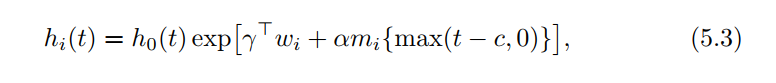

```{r setup, include=FALSE}
knitr::opts_chunk$set(echo = TRUE)
library(tidyverse)
library(survival)
library(JM)

library(broom.mixed)
```

```{r echo=FALSE, out.width='100%'}


```

wi1 is used to accommodate the direct effects of baseline
covariate to the risk for an event, and wi2 contains interaction terms 
that expand the association of mi(t) in different subgroups in the data. 
When wi2 contains only the constant term

```{r}
lme_fit <- lme(log(serBilir) ~ drug * (year + I(year^2)),
               random = ~ year + I(year^2) | id, 
               data = pbc2)

cox_fit <- coxph(Surv(years, status2) ~ drug + hepatomegaly,
                 data = pbc2.id, 
                 ## logical value: if TRUE,
                 ## the x matrix is returned 
                 ## in component x.
                 x = TRUE)
```


```{r}
# joint_fit <- jointModel(lme_fit, 
#                            cox_fit, 
#                            timeVar = "year",
#                            method = "piecewise-PH-aGH",
#                            interFact = list(value = ~ hepatomegaly, 
#                                             ##  a named list with a component named value 
#                                             ##  that provides an R formula specifying the 
#                                             ##  form of the W2 design matrix
#                                             data = pbc2.id))
# save(joint_fit, file = "joint_fit_20210208.Rdata")
load("joint_fit_20210208.Rdata")

summary(joint_fit)
```

```{r echo=FALSE, out.width='100%'}

```
that the risk at time t depends on the true value of the longitudinal marker at time t−c, 
where c specifies the time lag of interest

```{r}
prothro <- JM::prothro %>% 
  na.omit() 

prothro$t0 <- as.numeric(prothro$time == 0)

lme_pro <- lme(pro ~ treat * (ns(time, 3) + t0),
               ## ns() generate basis matrix 
               ## for natural cubic splines
               random = list(id = pdDiag(form = ~ ns(time, 3))),
               data = prothro)

cox_pro <- coxph(Surv(start, stop, event) ~ treat, 
                 data = prothro,
                 x = TRUE)

cox_pro2 <- coxph(Surv(Time, death) ~ treat, 
                 data = prothros,
                 x = TRUE)
```

```{r}
summary(cox_pro)
summary(cox_pro2)
anova(cox_pro2, cox_pro, test = FALSE)
```

```{r}
joint_pro <- jointModel(lme_pro,
                        cox_pro2,
                        timeVar = "time",
                        method = "piecewise-PH-aGH")
joint_pro2 <- update(joint_pro, lag = 2)

save(joint_pro, file = "joint_pro_20210208")
save(joint_pro2, file = "joint_pro2_20210208")
# 
load("joint_pro_20210208")
load("joint_pro2_20210208")
```


```{r}
summary(joint_pro)
summary(joint_pro2)
anova(joint_pro, joint_pro2)
```


```{r echo=FALSE, out.width='100%'}
knitr::include_graphics('img/f5_1.png')

knitr::include_graphics('img/f3_1.png')
```


```{r echo=FALSE, out.width='100%'}

```


```{r}
## take the interaction term off
# joint_pbc2 <- update(joint_fit, interFact = NULL)
# save(joint_pbc2, file = "joint_pbc2_20210208.Rdata")
load("joint_pbc2_20210208.Rdata")

## add time-dependent slopes term
## use the parameterization and derivForm
## fixed and random for fixed- and random effects 
## design matrices in the definition of m'i(t), 
## respectively, vectors named indFixed and indRandom
dform <- list(fixed = ~ I(2 * year) + drug + I(2 * year):drug,
              ## the third to sixed fixed effects of mi(t) used
              indFixed = 3:6, 
              random = ~ I(2 * year), 
              ## the second and thrid random effect of mi(t)
              indRandom = 2:3)

# joint_pbc3 <- update(joint_pbc2, 
#                      parameterization = "both",
#                      derivForm = dform)
# save(joint_pbc3, file = "joint_pbc3_20210208.Rdata")
load("joint_pbc3_20210208.Rdata")

summary(joint_pbc3)
```

the output ‘Assoct.s’, is highly associated with the risk for death. 
association of the slope on the true effect of mi

```{r}
anova(joint_pbc3, process = "Event")
anova(joint_pbc3, process = "Longitudinal")
?anova
```


