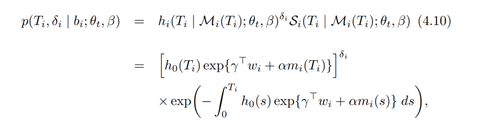
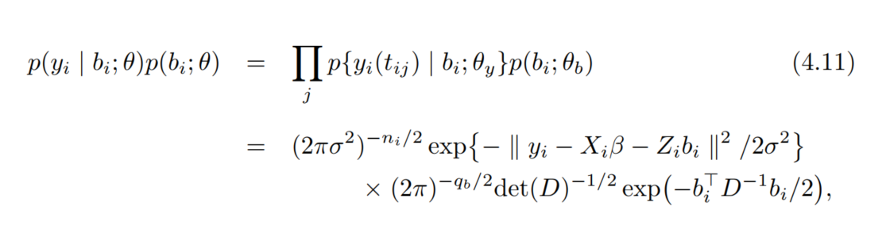
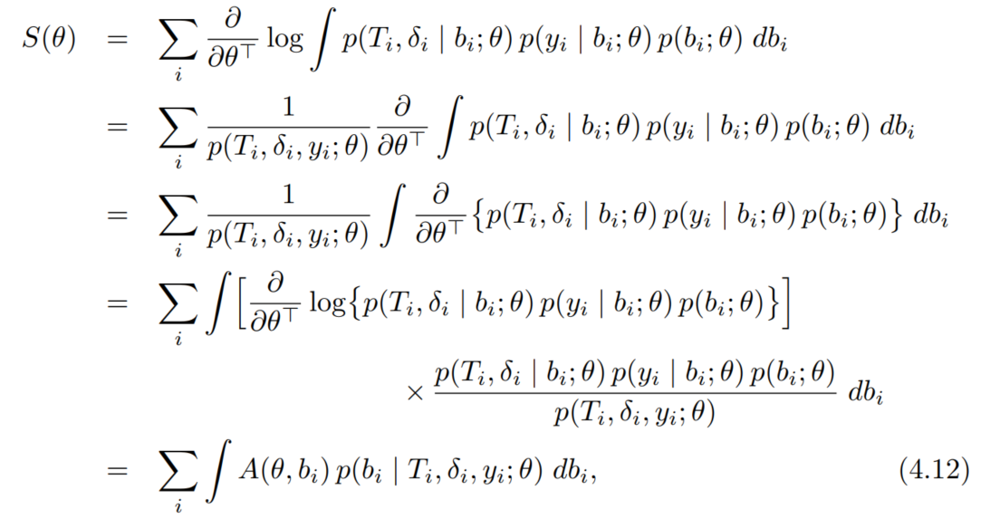
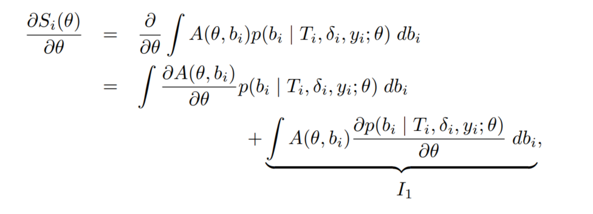
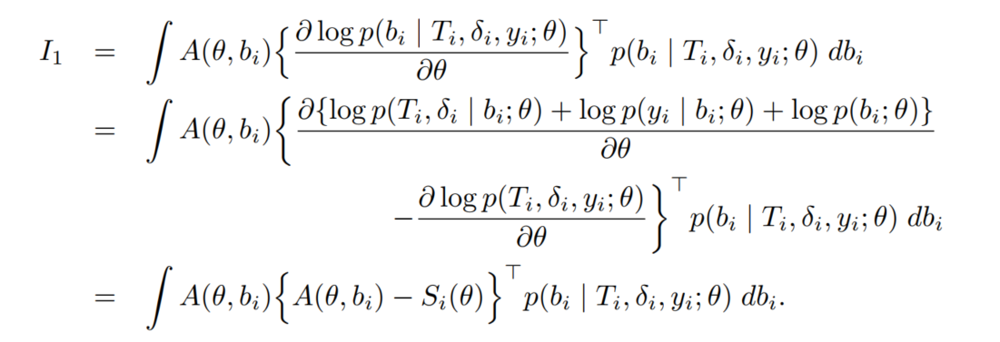
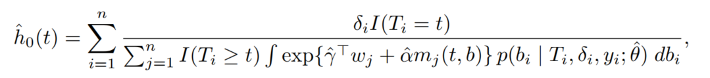
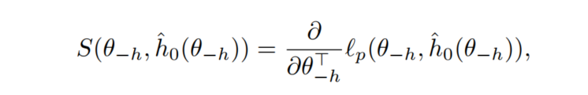

these notes are directly from  the textbook:\
"Joint Models for Longitudinal and Time-to-Event Data With Applications in R"\
by Dimitris Rizopoulos\
CRC Press/Taylor & Francis Group/A Chapman & Hall Book\


```{r setup, include=FALSE}
knitr::opts_chunk$set(echo = TRUE)
library(tidyverse)
library(survival)
library(JM)
library(broom.mixed)
```

```{r}
lme_p1 <- lme(log(serBilir) ~ year + drug:year,
              random = ~ year | id,
              data = pbc2)

summary(lme_p1)

# broom.mixed::augment(lme_p1)
# broom.mixed::tidy(lme_p1)
# broom.mixed::glance(lme_p1)
```

```{r}
mcov_p1 <- getVarCov(lme_p1,
                     individuals = 1:6,
                     ## type: "random effects",
                     ## "conditional"
                     type = "marginal")

cov_p1_1 <- cov2cor(mcov_p1[[1]])
cov_p1_2 <- cov2cor(mcov_p1[[5]])
```

```{r}
## use expand.grid to set a new design matrix
## to get the predict value for individual 6
contrast6 <-
  expand.grid(
    id = 6,
    year = c(0.5, 1.5),
    drug = c("D-penicil", "placebo"))
contrast6$pred <-
  predict(
    object = lme_p1,
    newdata = contrast6)
contrast6

contrast <-
  expand.grid(
    year = c(0.5, 1.5),
    drug = c("D-penicil", "placebo"))
contrast$pred <-
  predict(
    object = lme_p1,
    newdata = contrast,
    level = 0)
contrast

```

```{r}
lme_p2 <- lme(log(serBilir) ~ year + drug:year, 
              ## with a diagnoal covariance matrix
              ## to construct a pdiag class
              ## a diagnoal positive definite matrix
              random = list(id = pdDiag(form = ~ year)),
              data = pbc2)
summary(lme_p2)
```

```{r}
lme_y1 <- lme(log(serBilir) ~ year,
              random = list(id = pdDiag(form = ~ year)),
              data = pbc2)
summary(lme_y1)
```

```{r}
lme_y2 <- lme(log(serBilir) ~ bs(year), 
              random = list(id = pdDiag(form = ~ bs(year))),
              data = pbc2)
summary(lme_y2)
```

for the joint model, the parameters number, including in the linear
predictor and in the model for baseline hazard should be 1/10 and 1/20
of the total number of events in the sample.

the number of spline coefficients m\
the degree of B-spline basis function q\
the number of interior knots n\
m = n + q - 1\

increasing the number of knots can increase the flexibility, but keep a
balance between bias and variance and avoid overfitting.\

after the number of knots decided, the location depends on the
percentiles of censor and event times.

```{r}
lme_y3 <- lme(log(serBilir) ~ bs(year, knots = c(2, 5)), 
              random = list(id = pdDiag(form = ~ bs(year, knots = c(2, 5)))),
              data = pbc2)
summary(lme_y3)
```

```{r}
lme_y4 <- lme(log(serBilir) ~ bs(year, 
                                 ## provide either df or knots
                                 # df = length(knots) + degree + 1
                                 knots = c(2, 5)),
              random = list(id = pdDiag(form = ~ year)),
              data = pbc2)

mcov_y4 <- getVarCov(lme_y4, 
                     individuals = 5, 
                     type = "marginal")
mcor_y4 <- cov2cor(mcov_y4[[1]])

summary(lme_y4)
# broom.mixed::augment(lme_y4)
# broom.mixed::glance(lme_y4)
```

```{r}
td_cox <- coxph(Surv(start, stop, event) ~ drug + CD4,
                data = aids)

surv1 <- Surv(aids$start, aids$stop, aids$event)
surv2 <- aids %>%
  with(Surv(stop, event))

# surv1; surv2

td_cox

td_cox$coefficients[[2]] %>% exp()
## one unit increase of CD4 cell counter 
## will make the risk for death decreased
## to 82.41% of the chance
```

```{r}
aids_id <- aids[!duplicated(aids$patient), ]
```

we need to elaborate specification of time structures in the time effect
for longitudinal submodel. possibly the interactions between the
postulated time structure and baseline covariates.

1.  consider flexible representations for high order polynomials and
    splines.
2.  incorporate an additional stochastic term

to capture the remaining serial correlation in the observed
measurements. for example: Ornstein-Uhlenbeck process, and latent
stationary Gaussian process\

it is advisable to opt for either 1 or 2; but not necessary for both.

```{r}
lme_aids <- lme(CD4 ~ obstime + obstime:drug,
                random = ~ obstime | patient, 
                data = JM::aids)


cox_aids <- coxph(Surv(Time, death) ~ drug,
                  data = JM::aids.id, 
                  model = TRUE,
                  x = TRUE)
```

```{r}
joint_aids <-
  JM::jointModel(
    lmeObject = lme_aids,
    survObject = cox_aids,
    ## required in internal computation of mi(t)
    ## the true value of the time-dependent-varying
    timeVar = "obstime",
    ## the type of baseline risk function
    ## assumed to be piecewise constant
    method = "piecewise-PH-aGH")
# save(joint_aids, file = "joint_aids.Rdata")

load("joint_aids.Rdata")
summary(joint_aids)
# str(joint_aids)
```

the parameter labeled "Assoct" is the alpha; the association between
mi(t) and the risk for death.

the xi.. are the epslion parameters for piecewise-constant baseline risk
function.

comparison to the cox extended model, we clearly see non-negligible
differences.

$$ h_{0} (t) = \sum^Q_{q=1} \xi_{q} I(v_{q-1} < t< v_q) \ \ \ \ \ (4.3)$$
$$ log \ h_0(t) = \kappa_0 + \sum^m_{d=1}\kappa_dB_d(t,q)\ \ \ \ \ (4.4)$$

$$ \begin{cases}
  y_i(t) = m_i(t) + \epsilon_i(t) \\ 
  m_i(t) = x_i^T(t)\beta + z_i(t)b_i \ \ \ \ \ \ \ \ \ \ \ \ \ \ \ \ \ \ \ \ \ \ (4.5)\\ 
  b_i \sim N(0, D) \\ 
  \epsilon_i \sim N(0, \sigma^2) 
\end{cases} $$

for stochastic process independent of $b_i$, $\epsilon_i$:
$$ y_i(t) = m_i(t) + u_i(t) + \epsilon_i(t) \ \ \ \ \ (4.6) $$

currently the package::JM() only works with linear mixed effects
submodels with iid error terms and no serial correlation structures as (4.6)

cannot add a correlation structure (correlation argument)
or a variance function (weights argument)

regarding to the covariance matrix of the random effects, 
by default JM::jointModel() assumes it to be unstructured.

it also allows for a diagonal covariance matrix, 
which can be specified using function pdDiag() in the random argument of lme().


```{r}
# joint_aids_gh <-
#   JM::jointModel(
#     lmeObject = lme_aids,
#     survObject = cox_aids,
#     ## required in internal computation of mi(t)
#     ## the true value of the time-dependent-varying
#     timeVar = "obstime",
#     ## the type of baseline risk function
#     ## assumed to be piecewise constant
#     method = "piecewise-PH-GH")
# 
# save(joint_aids_gh, file = "joint_aids_gh_20210207.Rdata")

load("joint_aids_gh_20210207.Rdata")
summary(joint_aids_gh)
```


```{r}
# joint_aids_aft_wb <-
#   JM::jointModel(
#     lmeObject = lme_aids,
#     survObject = cox_aids,
#     ## required in internal computation of mi(t)
#     ## the true value of the time-dependent-varying
#     timeVar = "obstime",
#     ## the type of baseline risk function
#     ## assumed to be piecewise constant
#     method = "weibull-AFT-GH")
# 
# save(joint_aids_aft_wb, file = "joint_aids_aft_wb_20210207.Rdata")

load("joint_aids_aft_wb_20210207.Rdata")
summary(joint_aids_aft_wb)
```


the main estimation methods for joint models is the semiparametric maximum likelihood.
this semi-MLE has asymptotic properties under an unspecified baseline risk function.

joint distribution of the observed outcomes ${T_i, \ \delta_i,\  y_i}$.

conditional on the random effects which independent of time.
random effects acount for both the association between the longitudinal and event outcomes.

$$ p(T_i, \delta_i, y_i; \theta) = p(T_i, \delta_i|b_i; \ \theta)p(y_i|b_i; \ \theta) \ \ \ (4.7)$$

$$p(y_i|b_i; \ \theta) = \prod_jp\{ y_i(t_{ij})|b_i \ ; \theta\} \ \ \ \ \ \ \ (4.8)$$

$\theta = (\theta_t^T, \theta_y^T, \theta_b^T)^T$

the censoring mechanism and the visiting process are independent 
of the true event times and future longitudinal measurements. \


for any time point t, 
we define as observed history all available information 
for the longitudinal process prior to t. \

imply the belief that decisions on whether a subject withdraws 
from the study or appears at the clinic 
for a longitudinal measurement depend 
on the observed past history 
(longitudinal measurements and baseline covariates),
but there is no additional dependence on underlying, 
latent subject characteristics associated with prognosis. 

A setting in which these assumptions are violated is 
when either of the two processes depends on the random effects. 

This is because such a dependence implicitly corresponds to
a dependence to future longitudinal measurements. 

Evaluating the plausibility of the non-informativeness
for the visiting and censoring processes usually requires 
external information from subject-matter experts,
since the observed data do not contain enough information
to suggest otherwise

if the score equations corresponding to (4.12) are solved 
with respect to ??, with p(bi | Ti, ??i, yi; ??)
fixed at the ?? value of the previous iteration, 
then this corresponds to an EM algorithm, 
whereas if the score equations are solved with respect 
to ?? considering p(bi | Ti, ??i, yi; ??), also a function of ??,
then this corresponds to a maximization of the observed data log-likelihood l(??).

```{r echo=FALSE, out.width='100%'}





```

standard errors and inference for the regression coefficients of 
the (extended) Cox model enjoy nice asymptotic properties similar 
to those of asymptotic maximum likelihood theory, 
without having to specify an appropriate baseline risk function 

Unfortunately, under the joint modeling framework this nice feature is not carried over

a full likelihood approach must be employed instead.

In order for profile likelihood asymptotic to work, 
this nonparametric maximum likelihood estimator should not depend on h0(t)

Unfortunately, however, this is not the case under joint models 
because this estimator has no closed-form solution due to the use of random effects.

```{r echo=FALSE, out.width='100%'}


```

A feasible alternative is to postulate a flexible but parametric model for h0(t). 
1. they can be made arbitrarily flexible 
by increasing the number of internal knots, 
and thus capture various shapes of h0(t)\
2. under such models, estimation of standard errors directly follows 
from asymptotic maximum likelihood theory\


```{r}
anova(joint_aids, joint_aids_gh)
```


```{r}
anova(joint_aids, process = "Longitudinal")
anova(joint_aids, process = "Event", L = diag(2))
anova(joint_aids_aft_wb, process = "Longitudinal")
anova(joint_aids_aft_wb, process = "Event", L = diag(3))
anova(joint_aids_gh, process = "Longitudinal")
anova(joint_aids_gh, process = "Event", L = diag(2))
```

```{r}
pwc <- piecewiseExp.ph(cox_aids)
pwc$coefficients
```


